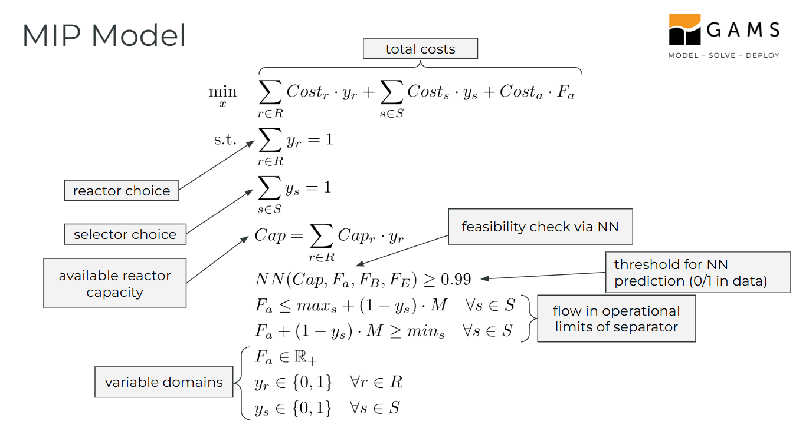

# Surrogate model example

This [GAMSPy](https://gamspy.readthedocs.io/en/latest/index.html) example shows how to embed a trained neural network into a GAMSPy optimization model (a mixed-integer linear program in this case) by utilizing the new sub-package [formulations](https://gamspy.readthedocs.io/en/latest/reference/gamspy.formulations.html) in GAMSPy.

More infos and examples on machine learning related capabilities of GAMSPy can be found in the GAMSPy user guide section on [GAMSPy and machine learning](https://gamspy.readthedocs.io/en/latest/user/ml/ml.html#gamspy-and-machine-learning).

## Quick start

If needed, setup a virtual environment or switch into a pre-existing one and install all packages from `requirements.txt`.

Spells to install from scratch with only a Python interpreter installed (tested with 3.12):
```
python -m venv venv
source venv/bin/activate # or use .ps1 script on Windows
pip install -r requirements.txt
python main.py
```

The NN is trained on the first run and saved to disk as `rs.pth`. Subsequent runs skip the training and only solve the optimization model.

## Model formulation



The objective function computes the total cost incurred by the choice of reactor $r$ and selector $s$ plus the cost for the input material flow rate $F_a$. The first constraints ensure exactly one reactor and exactly one separator is chosen. Following equation links the auxiliary variable $V$ for the available volume with the volume of the chosen reactor. The next constraint uses the embedded NN to predict a feasibility probability for a given tuple of reactor volume $V$, input flow rate $F_a$ and output material flow rate demands $F_B$ and $F_E$. The feasibility prediction acquired through NN inference must be at least 99\%. Subsequent equations make sure the input material flow rate is inside the operational bounds of the chosen selector using a bigM-formulation. The decision variable domains are declared such that the input material flow rate and available volume auxiliary variable are continuous, and the reactor- $y_r$ and selector-choice $y_s$ indicator variables are binary.

To solve the model with a MILP solver, the parameterized NN term $NN$ in must be expanded into a set of additional constraints and variables, such that the left-hand side of evaluates to the value acquired by doing a forward propagation of input vector $(V,F_a,F_B,F_E)$ through the network layers. The NN is sequential and consists of 4 linear layers connected with ReLU and sigmoid as activation functions for the inner layers and output layer respectively.